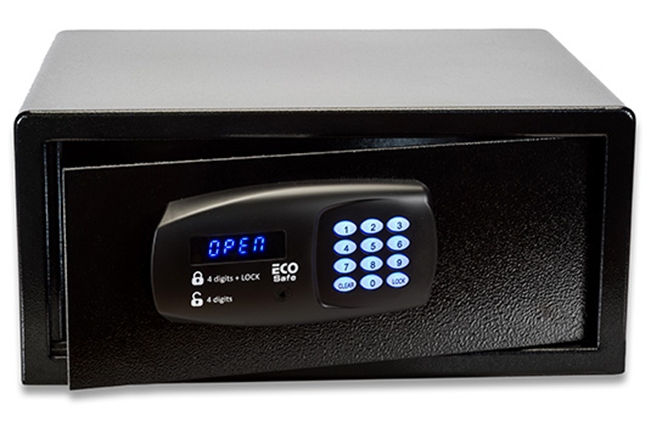
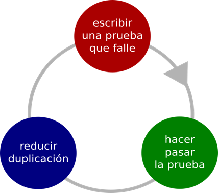
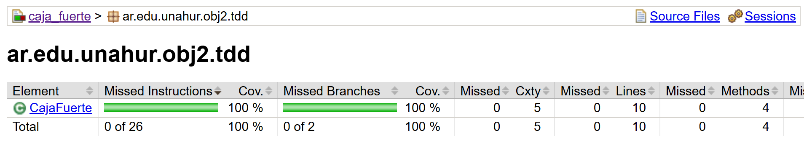

# TDD - Test Driven Development

Modelaremos el comportamiento de una caja fuerte con las siguientes funcionalidades:

- Abrirla → Ingresando el código de apertura correcto.

- Cerrarla → Estableciendo un nuevo código de seguridad.

- Verificar estado → Consultar si está abierta o cerrada.

## Objetivo

Utilizaremos la técnica del desarrollo conducido por las pruebas donde usaremos la siguiente secuencia al escribir los test

- ROJO: Escribir una prueba que falle.
- VERDE: Hacer que la prueba pase.
- AZUL: Reducir duplicación.
- Vuelta a empezar.

### Coverage

Lograr el 100% del covertura sobre la clase que modela la caja fuerte

